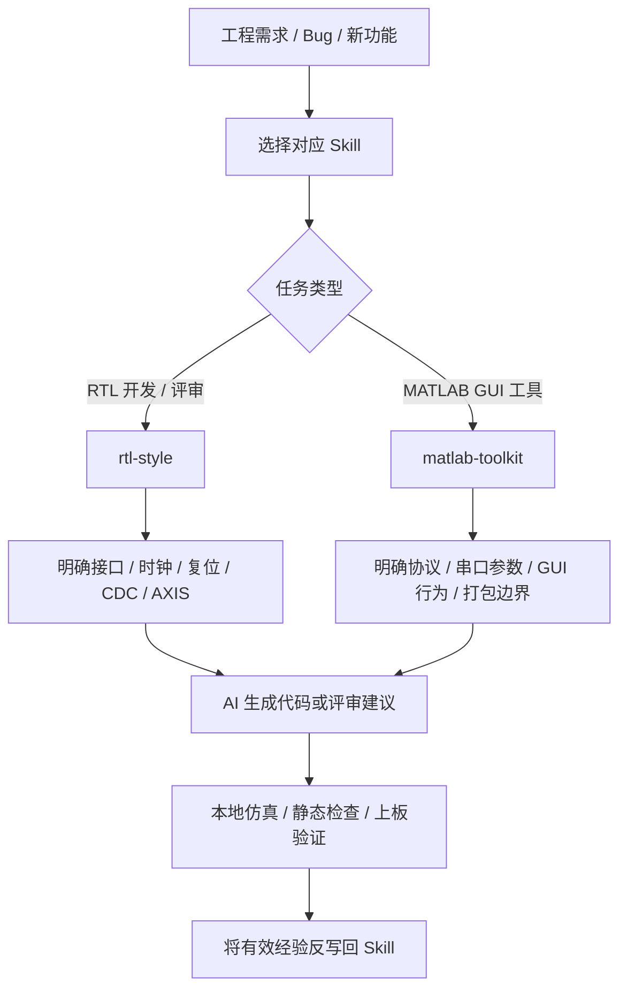

# sopc-skill ⚙️

> 面向 SoPC / FPGA / RTL / MATLAB 上位机开发流程的自定义 AI Skill 集合

<div align="center">

  <h3>让 AI 更懂 FPGA 工程，而不只是会写代码</h3>

  <p>
    一组沉淀自真实 SoPC 开发流程的 AI 协作规范，用于约束 ChatGPT、Codex 和其他 AI coding agent 在 RTL 编写、代码评审、MATLAB 调试工具开发中的行为边界。
  </p>

  <p>
    
    
    
    
    
  </p>

  <p>
    <a href="#-项目简介">项目简介</a> •
    <a href="#-核心技能">核心技能</a> •
    <a href="#-适用场景">适用场景</a> •
    <a href="#-仓库结构">仓库结构</a> •
    <a href="#-使用方式">使用方式</a> •
    <a href="#-交流与改进">交流与改进</a>
  </p>

</div>

---

## 📖 项目简介

`sopc-skill` 是一个面向 **SoPC / FPGA / 嵌入式板卡调试** 的自定义 AI Skill 仓库。

这个仓库来自我个人在 SoPC 开发过程中的实际使用经验，主要用于沉淀一组“让 AI 更适合参与硬件工程开发”的规则和模板。

在真实 FPGA / SoPC 项目中，AI 不只是要“能写代码”，还要尽量做到：

- 不乱补工程事实；
- 不破坏已验证链路；
- 不随意改接口边界；
- 理解 AXIS、CDC、pipeline、timing closure 等硬件开发风险；
- 生成的 Verilog RTL 更适合综合、仿真、评审和上板；
- 生成的 MATLAB GUI 工具更适合长期调试和交付；
- 没有实际运行过仿真、综合、打包时，不假装已经验证通过。

这个仓库的目标，就是把这些工程习惯整理成可复用的 AI Skill。

---

## ✨ 核心技能

目前包含两个自定义 skill：

| Skill | 方向 | 说明 |
| :--- | :--- | :--- |
| [`rtl-style`](./rtl-style) | Verilog RTL | 面向 Vivado / Vitis FPGA 工程的 RTL 编码与评审规范 |
| [`matlab-toolkit`](./matlab-toolkit) | MATLAB GUI | 面向 FPGA / SoPC 板卡调试的 MATLAB 上位机工具开发规范 |

---

## 🧠 rtl-style

`rtl-style` 用于约束 AI 在编写、修改或评审 Verilog RTL 时的行为。

它重点关注的不是“写出一段看起来能跑的代码”，而是让 AI 尽量生成更加工程化的 RTL：

- 可综合；
- 可仿真；
- 可评审；
- 风格统一；
- 对 AXI4-Stream 友好；
- 对 CDC 风险敏感；
- 对 pipeline 和 timing closure 友好；
- 默认使用中文注释说明关键设计意图。

### 典型使用场景

- 创建 Verilog RTL 模块；
- 重构已有 RTL；
- 编写 AXI4-Stream 数据通路；
- 修改 packet / frame builder；
- 处理 FSM、计数器、状态统计；
- 检查 ready / valid 握手；
- 增加 pipeline；
- 排查 timing 风险；
- 检查 CDC 和复位边界；
- 让 AI 评审 RTL 风格和潜在问题。

### 重点约束

- 默认使用 Verilog-2001；
- 使用 ``default_nettype none``；
- 不依赖隐式 wire；
- 不推断 latch；
- 不制造组合环；
- 不跨多个 `always` 块驱动同一个 `reg`；
- AXIS 在 `tvalid && !tready` 时必须保持 payload 稳定；
- CDC 不能直接跨时钟采样多 bit 总线；
- 不声称未实际运行过的仿真、综合、实现或时序检查已经通过。

---

## 🛠️ matlab-toolkit

`matlab-toolkit` 用于指导 AI 开发和维护 MATLAB GUI 上位机调试工具。

它主要服务于 FPGA / SoPC / 嵌入式板卡调试中的这些任务：

- 串口调试；
- 协议帧生成；
- 协议帧解析；
- 寄存器读写；
- 遥测信息解析；
- RX / TX 彩色日志；
- 周期发送；
- MATLAB GUI 工具打包；
- MATLAB Runtime 交付说明。

### 设计目标

`matlab-toolkit` 希望避免 AI 把上位机工具写成一次性脚本，而是尽量让工具具备：

- 清晰的 GUI 结构；
- 明确的协议边界；
- 可复用的串口收发逻辑；
- 可读的 RX / TX 日志；
- 可维护的解析函数；
- 清楚的打包边界；
- 对实际 MATLAB 运行环境的诚实表述。

### 重点约束

- 通道能力可以复用，业务协议必须替换；
- 不机械复用旧工程协议；
- 不把 EXE、RuntimeInstaller、`dist`、cache、中间构建文件放进 skill；
- 没有 MATLAB 环境时，只能做结构检查和静态检查；
- 不假装 GUI、串口通信或打包已经验证通过。

---

## 🎯 适用场景

这个仓库适合这些场景：

| 场景 | 说明 |
| :--- | :--- |
| AI 生成 RTL | 让 AI 按更适合 FPGA 工程的方式写 Verilog |
| RTL 代码评审 | 检查 AXIS、CDC、FSM、pipeline、timing 风险 |
| SoPC 数据通路开发 | 约束 AI 不随意破坏接口、时钟域和已验证链路 |
| MATLAB 调试工具开发 | 生成更适合板卡调试的 GUI 上位机 |
| Agent 协作规范沉淀 | 把个人工程经验固化成可复用 skill |
| 团队风格统一 | 给团队内部 AI coding agent 提供统一行为边界 |

---

## 📁 仓库结构

```text
sopc-skill/
├── README.md
├── rtl-style/
│   ├── SKILL.md
│   ├── agents/
│   │   └── openai.yaml
│   └── references/
│       ├── axis_registered_stage_template.v
│       └── verilog_module_skeleton.v
└── matlab-toolkit/
    ├── SKILL.md
    ├── README.md
    ├── CHANGELOG.md
    └── review_questions.md
````

---

## 🚀 使用方式

### 方式一：作为 ChatGPT / Codex Skill 使用

将对应目录作为自定义 skill 引入：

```text
rtl-style/
matlab-toolkit/
```

然后在使用 AI coding agent 时，通过 skill 约束其行为。

例如：

```text
Use $rtl-style to review this AXI4-Stream packet builder and suggest timing-friendly improvements.
```

或者：

```text
Use $matlab-toolkit to create a MATLAB GUI serial debug tool for this FPGA board protocol.
```

---

### 方式二：直接复制 SKILL.md

如果你的工具链暂时不支持完整 skill 目录，也可以直接复制：

```text
rtl-style/SKILL.md
matlab-toolkit/SKILL.md
```

将其中内容放入自己的 AI agent system prompt、project instruction 或 Codex instruction 中。

---

### 方式三：按项目二次定制

建议根据自己的工程继续补充：

* 本地工程目录；
* RTL 命名规范；
* AXIS / AXI-Lite / DDR / DMA 接口约定；
* 时钟和复位约定；
* 仿真命令；
* Vivado 综合 / 实现流程；
* MATLAB 工具协议字段；
* 板卡调试流程；
* 代码提交和验收标准。

---

## 🏗️ 推荐 AI 协作流程



---

## ✅ 我希望这些 Skill 解决什么问题

### 对 RTL

* 减少“看起来能跑但不利于时序”的 RTL；
* 减少 AXIS ready / valid 写错；
* 减少隐式 wire、latch、组合环；
* 减少 CDC 风险被忽略；
* 减少 debug 逻辑影响主数据通路；
* 让 AI 在写代码时主动考虑 pipeline 和 timing。

### 对 MATLAB 工具

* 减少一次性脚本；
* 减少协议解析散落各处；
* 减少 GUI 逻辑和通信逻辑混在一起；
* 减少打包产物污染源码目录；
* 让 AI 更清楚地区分“结构检查”和“实际运行验证”。

### 对 AI 协作

* 减少 AI 乱改边界；
* 减少 AI 没验证却说验证通过；
* 减少“过度设计”和“瞎补细节”；
* 让 AI 更像一个工程协作者，而不是单纯代码生成器。

---

## 🗺️ 后续计划

后续可能继续补充：

* 更完整的 MATLAB GUI 模板；
* 更多 AXIS / FIFO / CDC RTL reference；
* packet builder / frame parser 示例；
* Vivado timing-friendly rewrite 案例；
* SoPC 最小系统、DDR、AXI-Lite、HP 口数据通路协作规范；
* 板卡 bring-up 和 debug prompt 模板；
* 面向 Codex 的项目交接模板。

---

## 🤝 交流与改进

这个仓库来自个人 SoPC / FPGA 开发中的实际经验，目前仍在持续调整。

如果你也在做：

* FPGA；
* SoPC；
* Vivado / Vitis；
* Verilog RTL；
* AXI4-Stream；
* 板卡调试；
* MATLAB 上位机工具；
* AI coding agent 工程化使用；

欢迎交流、提 issue、fork 或提出改进建议。

也欢迎根据自己的团队习惯，把这些 skill 改造成适合自己项目的版本。

---

## 📌 说明

本仓库不是完整 SoPC 工程，也不是可直接运行的板卡工程。

它更像是一个：

> AI + FPGA / SoPC 工程经验沉淀仓库

目标是帮助 AI 在参与硬件开发时更加稳健、保守、工程化。

```

这一版就比较接近你发的那个项目 README 的观感了：有标题、有 slogan、有 badge、有导航、有功能解析、有 mermaid 流程图、有后续计划，也能体现“这是你在自己 SoPC 开发过程中沉淀出来并愿意分享交流的东西”。
```
